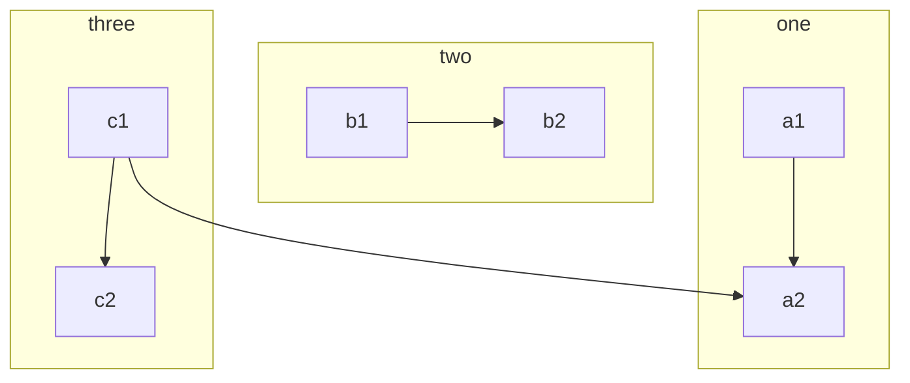

```txt
---
title: Node
---
flowchart LR
     id1[This is the text in the box]


flowchart LR
    markdown["`This **is** _Markdown_`"]
    newLines["`Line1
    Line 2
    Line 3`"]
    markdown --> newLines
```


`NodeName["display"]` --- 

- `"` 将unicode 文本括起来。
- 使用双引号和反引号将 markdown 文本括起来
-  方向 ： 
	- TB - 从上到下
	- TD - 自上而下/与从上到下相同
	- BT - 从下到上
	- RL - 从右到左
	- LR - 从左到右


### 节点形状

- `[]`  方形
- `()` 圆边方形
- `([])` 体育场形状
- `[[]]` 子程序形状
- `[()]` 圆柱形
- `(())` 圆形
- `>]`不对称节点
- `{}` 菱形
- `{{}}` 六边形
- `[//] [\\]`平行四边形
- `[/\] [\/]` 梯形
- `((()))`双圆

其他形状 [其他形状及对应代码](https://mermaid.nodejs.cn/syntax/flowchart.html?id=flowcharts-basic-syntax#expanded-node-shapes-in-mermaid-flowcharts-v1130)

`A@{ shape: manual-file, label: "File Handling"}`

### 节点之间的连接

- `-->` 箭头
- `---` 连线
- `--xxx--   --|xxx|`  有文本的连线
- `-->|xxx| --xx-->` 
- `-.-> -.xxx.->` 虚线
- ` ==> ==xx==>`  粗线
- `~~~` 看不见的线

**箭头类型**

- `--o`
- `--x`
- 可以双向

**线的长度**

| 长度      | 1       | 2        | 3         |
| ------- | ------- | -------- | --------- |
| 普通的     | `---`   | `----`   | `-----`   |
| 正常带箭头   | `-->`   | `--->`   | `---->`   |
| 点状      | `-.-`   | `-..-`   | `-...-`   |
| 带有箭头的虚线 | `-.->`  | `-..->`  | `-...-`   |

同时声明

```txt
flowchart LR
   A -- text --> B -- text2 --> C

flowchart LR
   a --> b & c--> d

// 依赖方式

flowchart TB
    A & B--> C & D
```


**添加ID**

```txt
flowchart LR
  A e1@--> B
  e1@{ animate: true } // 添加动画
  e1@{ animation: fast } // fast or slow
```


## 子图

`subgraph id [dispalay]`

```
subgraph title [one]
    graph definition
end
```



**子图方向**

`direction TB`

```
flowchart LR
  subgraph TOP
    direction TB
    subgraph B1
        direction RL
        i1 -->f1
    end
    subgraph B2
        direction BT
        i2 -->f2
    end
  end
  A --> TOP --> B
  B1 --> B2
```

## 样式和类别

https://mermaid.nodejs.cn/syntax/flowchart.html?id=flowcharts-basic-syntax#styling-and-classes

可以设置链接样式。例如，你可能想要设计一个在流程中向后移动的链接。由于链接没有像节点一样的 id，因此需要其他一些方法来决定链接应附加到什么样式。使用图表中定义链接时的顺序号来代替 ids，或者使用默认值应用于所有链接。在下面的示例中，linkStyle 语句中定义的样式将属于图中的第四个链接：